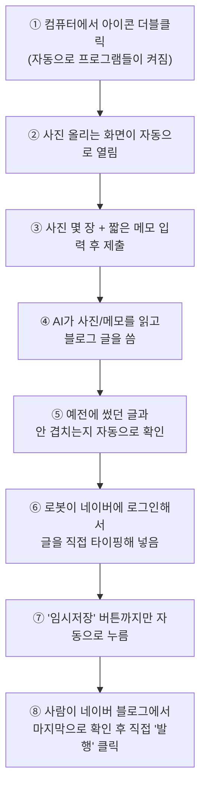

# 원하다 필라테스 블로그 자동화

## 이 프로그램은 무엇을 하나요?

사진 몇 장과 짧은 메모만 입력하면, 나머지는 자동으로 처리됩니다:

1. AI(Claude)가 그 사진과 메모를 보고 **네이버 블로그에 어울리는 글**을 씁니다 (제목, 도입부, 본문, 마무리 인사)
2. 그 글을 **실제 네이버 블로그 글쓰기 화면에 사람처럼 직접 타이핑**해서 넣습니다
3. **"임시저장"까지만** 해두고 멈춥니다 — 실제로 인터넷에 공개(발행)하는 버튼은 항상 **사람이 직접** 눌러야 합니다

즉, "글쓰기의 지루한 부분(타이핑, 사진 배치)"만 자동화하고, "이 글을 진짜로 올릴지 말지"는 항상 사람이 마지막에 결정하는 구조입니다.

> 지금은 안전하게 **본인의 개인 블로그로 먼저 테스트**하도록 만들어져 있습니다. 여러 번 문제없이 잘 되는 걸 확인한 뒤에, 실제 운영하는 블로그로 바꿔서 쓰시길 권합니다.

---

## 전체 그림 (한눈에 보기)



**정리하면**: ①~⑦번까지는 전부 자동, **⑧번(진짜로 세상에 공개하기)만 사람이** 합니다.

---

## 시작하기 전에 알아두면 좋은 용어

전문 용어를 최대한 줄였지만, 몇 가지는 꼭 필요합니다:

| 용어 | 쉬운 설명 |
|---|---|
| **Docker(도커)** | 여러 프로그램을 "미리 포장된 상자"처럼 내 컴퓨터에서 실행해주는 도구. 복잡한 설치 없이 이 상자만 실행하면 됩니다. |
| **n8n** | 여러 단계를 순서대로 자동으로 실행해주는 프로그램. "사진 오면 → AI 호출 → 블로그에 쓰기"를 이어주는 역할입니다. |
| **API 키** | AI(Claude)를 사용하기 위한 일종의 출입증 비밀번호. 이게 있어야 AI에게 글을 써달라고 요청할 수 있습니다. |
| **터미널(명령 프롬프트)** | 마우스 클릭 대신 글자로 명령을 입력하는 검은 화면. Windows에서는 "명령 프롬프트" 또는 "PowerShell"이라는 이름으로 검색하면 나옵니다. |
| **저장소(Repository, 레포)** | 이 프로젝트의 모든 파일을 모아둔 폴더 묶음. GitHub이라는 사이트에 올려두고 관리합니다. |

---

## 폴더 안에 뭐가 들어있나요

```
wonhada-blog-automation/
├── docker-compose.yml     ← "어떤 프로그램들을 켤지" 적어둔 설정 파일
├── start.bat              ← 바탕화면에 놓고 더블클릭할 실행 파일 (Windows용)
├── form/
│   └── index.html         ← 사진+메모 입력하는 화면
├── n8n/
│   └── workflow.json      ← "순서대로 뭘 할지" 적힌 자동화 설계도
└── naver-poster/          ← 네이버에 직접 타이핑해주는 로봇 담당 폴더
    ├── server.js
    └── login-capture.js   ← 네이버 로그인을 한 번 저장해두는 파일
```

세세한 내용을 다 이해하실 필요는 없고, **"이런 폴더가 있구나" 정도만 아셔도 충분**합니다.

---

## 준비물 체크리스트

시작하기 전에 아래 계정/프로그램이 필요합니다. 전부 무료입니다 (Claude AI 사용료만 소액 발생).

- [ ] Windows 컴퓨터
- [ ] [Docker Desktop](https://www.docker.com/products/docker-desktop/) 설치
- [ ] [Anthropic 콘솔](https://console.anthropic.com) 가입 (AI 사용료 결제용)
- [ ] Google 계정 (이미 있으실 가능성 높음)
- [ ] 네이버 블로그 계정
- [ ] [Vercel](https://vercel.com) 가입 (무료, 입력 화면을 인터넷에 올려두는 용도)

---

## 설정 순서 (하나씩 따라 하시면 됩니다)

### 1단계. 이 프로젝트 파일 내려받기

터미널(검은 화면)을 열고 아래를 순서대로 입력합니다:
```bash
git clone <이 저장소 주소>
cd wonhada-blog-automation
```
`git clone`은 "이 프로젝트 전체를 내 컴퓨터로 복사해오기"라는 명령입니다.

### 2단계. AI 사용료 계정 만들기

1. [console.anthropic.com](https://console.anthropic.com)에서 가입하고, **API 키**(출입증 비밀번호)를 하나 발급받습니다
2. 예상치 못한 큰 금액이 빠져나가지 않도록, **Settings → Limits**에서 "한 달에 최대 $5까지만 쓰기" 같은 상한선을 걸어둡니다 (강력 추천)

### 3단계. 기록장(구글시트) 만들기

AI가 예전에 썼던 글과 겹치지 않게 새 글을 쓰려면, "지금까지 뭘 썼는지" 적어둘 공간이 필요합니다.

1. [sheets.google.com](https://sheets.google.com)에서 새 문서 만들기
2. 화면 아래 탭 이름을 **"이력"**으로 바꾸기
3. 첫 줄에 왼쪽부터 순서대로 `날짜`, `제목`, `요약` 입력

### 4단계. 설정 파일에 비밀번호 채우기

`docker-compose.yml` 파일을 메모장으로 열어서, `N8N_BASIC_AUTH_PASSWORD` 옆에 원하는 비밀번호를 적어넣습니다. (이건 나중에 자동화 관리 화면에 들어갈 때 쓰는 비밀번호입니다)

### 5단계. 내 네이버 아이디 적어넣기

`naver-poster/server.js` 파일을 메모장으로 열어서, `YOUR_NAVER_ID`라고 적힌 부분을 본인의 실제 네이버 블로그 아이디로 바꿔줍니다.

### 6단계. 프로그램들 켜기

터미널에서:
```bash
docker compose up -d --build
```
이 명령 하나로 필요한 프로그램들이 전부 컴퓨터 안에서 자동으로 준비됩니다. 처음 한 번은 몇 분 걸릴 수 있습니다.

### 7단계. 네이버에 딱 한 번 로그인해두기

터미널에서:
```bash
docker compose exec naver-poster node login-capture.js
```
브라우저 창이 뜨면 **직접 네이버에 로그인**합니다. 로그인이 끝나면 터미널로 돌아와서 **Enter 키**를 누르세요. 이렇게 하면 "이미 로그인된 상태"가 저장되어서, 이후로는 로봇이 다시 로그인할 필요 없이 이 상태를 그대로 씁니다. (아이디/비밀번호 자체는 어디에도 저장되지 않습니다)

### 8단계. 자동화 설계도 불러오기

1. 브라우저에서 `http://localhost:5678` 주소로 접속
2. 관리자 계정(아이디/비밀번호) 처음 설정
3. 화면에서 `n8n/workflow.json` 파일을 불러오기(Import)
4. AI 연결: `3. Claude로 초안 생성`이라는 상자를 눌러서, 2단계에서 만든 API 키 연결
5. 구글시트 연결: `1.5 이전 포스팅 이력 조회`와 `8. 이력 기록` 상자에 Google 계정 연결 + 3단계에서 만든 시트 지정
6. 화면 오른쪽 위 **Active** 스위치 켜기 — 이게 켜져야 자동화가 실제로 작동합니다

### 9단계. 네이버 화면 확인 (약간 손이 가는 단계)

네이버가 화면 구조를 자주 바꾸기 때문에, `naver-poster/server.js` 안에 적힌 "여기를 클릭하세요" 위치 정보가 실제와 다를 수 있습니다.

1. 크롬 브라우저에서 본인 네이버 블로그의 글쓰기 화면을 엽니다
2. 키보드 **F12**를 누르면 개발자 화면이 뜹니다
3. 제목 입력칸, 사진 버튼, 임시저장 버튼을 각각 마우스 우클릭 → "검사" 클릭
4. 거기 나오는 이름표(class)를 `server.js` 안의 해당 부분과 맞춰줍니다

*이 부분이 막히시면, 화면에서 확인하신 이름표를 그대로 알려주시면 코드를 맞춰드릴 수 있습니다.*

### 10단계. 입력 화면을 인터넷에 올리기

터미널에서:
```bash
cd form
vercel --prod
```
완료되면 `https://무언가.vercel.app` 같은 주소가 나옵니다. 이게 앞으로 쓸 "사진 올리는 화면" 주소입니다.

### 11단계. 아이콘에 주소 연결하기

`start.bat` 파일을 메모장으로 열어서, 10단계에서 나온 주소를 안에 붙여넣습니다.

### 12단계. 바탕화면 아이콘 만들기

`start.bat` 파일을 마우스 우클릭 → "바로 가기 만들기" → 그 바로 가기를 바탕화면으로 옮깁니다. 이제부터는 이 아이콘만 누르면 됩니다.

### 13단계. 실제로 테스트해보기

1. 방금 만든 바탕화면 아이콘 더블클릭
2. 사진 1장과 짧은 설명을 넣고 제출
3. 네이버 블로그에 들어가서 "임시저장" 목록에 새 글이 생겼는지 확인
4. 구글시트 "이력" 탭에도 기록이 남았는지 확인

여기까지 잘 되면 준비 완료입니다.

---

## 앞으로는 이렇게만 쓰시면 됩니다

```
바탕화면 아이콘 클릭
   → 사진 + 메모 입력
   → 제출
   → 네이버 블로그 "임시저장함"에서 확인
   → 마음에 들면 직접 "발행" 클릭
```

## 얼마나 드나요?

| 항목 | 비용 |
|---|---|
| Docker, 자동화 프로그램, 구글시트 | 무료 |
| 입력 화면 호스팅(Vercel) | 무료 |
| AI 사용료(Claude, 주 2회 기준) | 한 달에 약 500~700원 |

## 미리 알아두시면 좋은 점

- 네이버가 가끔 화면 디자인을 바꾸는데, 그러면 9단계에서 맞춰둔 부분이 다시 안 맞아서 자동화가 멈출 수 있습니다. 이럴 땐 다시 F12로 확인해서 고쳐야 합니다.
- 네이버 로그인 상태(7단계)는 시간이 지나면 풀릴 수 있습니다. 그러면 7단계를 한 번 더 해주시면 됩니다.
- 처음엔 꼭 **본인 블로그로 여러 번 테스트**해보시고, 문제없이 잘 된다는 확신이 들면 그때 실제 운영 블로그로 바꾸세요.

## 보안 관련 참고

- 네이버 로그인 정보는 컴퓨터 안(Docker 내부)에만 저장되고, 이 프로젝트 파일에는 포함되지 않습니다.
- API 키나 비밀번호를 GitHub에 실수로 올리지 않도록 `.gitignore`가 이미 설정되어 있습니다.
