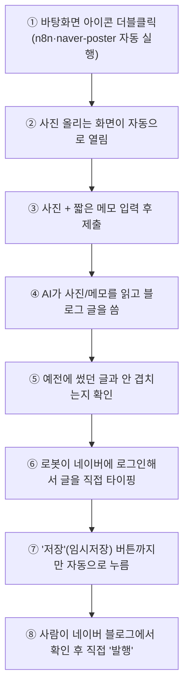

# 🧘 원하다 필라테스 블로그 자동화

**사진 몇 장 + 메모 한 줄 → AI가 블로그 글을 쓰고, 브라우저 자동화가 네이버 블로그에 직접 임시저장까지.**
어머니가 운영하는 필라테스 스튜디오의 블로그 운영 부담을 줄이기 위해 기획하고, 처음부터 끝까지 직접 구현·검증한 개인 프로젝트입니다.


---

## 📌 한눈에 보기

| | |
|---|---|
| **문제** | 비전공자가 블로그 글을 매번 구상·타이핑·고정정보 붙여넣기 하는 데 30~40분씩 소요, 결국 귀찮아서 건너뛰게 됨 |
| **해결** | 사진+메모만 입력하면 AI가 글을 쓰고, 브라우저 자동화가 네이버에 직접 타이핑해 임시저장 |
| **핵심 기술** | Claude API(멀티모달) · n8n · Playwright · Docker · Vercel |
| **결과** | 전체 소요 시간 **30~40분 → 5분 내외 (체감상 80%↓)**, 본인 블로그 대상 end-to-end 검증 완료 |
| **설계 원칙** | 반복 작업은 전부 자동화, **발행(공개)만은 항상 사람이 최종 확인 후 실행** |

## 목차

- [🎯 왜 만들게 되었는가](#-1-왜-만들게-되었는가)
- [🔧 어떻게 해결했는가](#-2-어떻게-해결했는가)
- [🏗️ 시스템 구성](#️-3-시스템-구성)
- [✨ 핵심 기능](#-4-핵심-기능)
- [⚖️ 차별점](#️-5-기존-방식도구와의-차별점)
- [📊 결과](#-6-결과)
- [🐛 오류와 해결 과정](#-7-겪었던-오류와-해결-과정)
- [💼 실무 적용 가능성](#-8-실무에-어떻게-도움이-될까)
- [🛠️ 설치 및 실행 가이드 (펼치기)](#️-설치-및-실행-가이드)

---

## 🎯 1. 왜 만들게 되었는가

어머니가 운영하시는 요가·필라테스 스튜디오는 네이버 블로그로 신규 회원을 유치하는 비중이 큽니다. 꾸준히 올려야 검색 노출에 유리하지만, 실제로는:

- AI를 채팅 정도로만 써보신 비전공자 입장에서, 매번 사진 고르고 글 구상하고 타이핑하는 과정이 부담스러움
- 문의전화·위치·영업시간·해시태그처럼 **매번 똑같이 들어가야 하는 정보**를 매번 손으로 복사-붙여넣기
- 결과적으로 "바쁘면 그냥 건너뛰기" 쉬운 구조

였습니다. "사진만 올리면 나머지는 알아서 되는" 수준으로 진입장벽을 낮추고 싶어서 이 프로젝트를 시작했습니다.

## 🔧 2. 어떻게 해결했는가

**핵심 설계 원칙**: 반복적인 부분(구상·타이핑·사진 배치·고정 정보 삽입)은 전부 자동화하되, **최종 발행 버튼만은 항상 사람이 누르도록** 안전장치를 남겨두는 것.

이걸 구현하는 과정에서 두 가지 큰 방향 전환이 있었습니다.

- **1차 시도 (카카오톡 전달 방식)**: AI가 만든 초안을 카카오톡으로 보내면 사람이 복사해서 붙여넣는 반자동 방식으로 시작. 네이버가 블로그 글쓰기 공식 API를 2020년에 완전히 없앤 걸 확인하고, 처음엔 "발행까지 자동화는 무리"라고 판단해 이 방식을 택했습니다.
- **2차 전환 (브라우저 자동화)**: 반자동 방식도 "매번 복사-붙여넣기"가 남아있다는 한계가 있어서, Playwright로 실제 브라우저를 조작해 **네이버 블로그 글쓰기 화면에 직접 타이핑하고 임시저장까지** 자동화하는 방향으로 전환했습니다. 다만 계정 자동 로그인은 네이버의 봇 탐지(디바이스 핑거프린팅) 위험이 있어 배제하고, **"사람이 한 번 로그인한 세션을 재사용"**하는 방식으로 안전하게 구현했습니다.

비용 구조도 여러 번 재검토했습니다. 처음엔 클라우드(Oracle Cloud + 도메인 + Basic Auth)로 상시 접근 가능하게 설계했다가, 실제 사용 빈도(주 2회)와 운영 복잡도를 감안해 **로컬 PC 실행 + Docker**로 단순화했습니다 — 인터넷에 노출되는 지점 자체가 없어지니 보안 문제도 같이 해결됐습니다.

## 🏗️ 3. 시스템 구성




| 구성 요소 | 역할 | 기술 |
|---|---|---|
| 입력 화면 | 사진+메모 수집 | 정적 HTML/JS, Vercel 배포 |
| 오케스트레이션 | 전체 흐름 연결 | n8n (셀프호스팅, Docker) |
| 콘텐츠 생성 | 제목/본문/CTA 생성, 이력 기반 중복 방지 | Claude API (멀티모달) |
| 블로그 자동 작성 | 실제 타이핑·이미지 삽입·임시저장 | Playwright (Chromium 자동화) |
| 실행 환경 | 전체 컨테이너 구동 | Docker Compose |

## ✨ 4. 핵심 기능

- **멀티모달 콘텐츠 생성**: 사진을 직접 읽어서 설명을 반영한 본문 작성, 이모지 소제목으로 가독성 확보
- **중복 방지**: 최근 포스팅 이력(제목/요약)을 저장해두고, 새 글이 소재·표현상 겹치지 않도록 프롬프트에 반영
- **실제 브라우저 자동 타이핑**: `[사진 N]` 마커 기반으로 본문 중간에 정확한 위치에 사진 삽입
- **고정 정보 분리**: 문의전화·위치·해시태그처럼 절대 틀리면 안 되는 정보는 AI가 생성하지 않고 코드에서 고정 삽입 (환각 위험 원천 차단)
- **안전장치 다중화**: 로그인 세션 만료 감지, Claude 응답 파싱 실패 시 깨진 내용 게시 방지, 실패 시 자동 스크린샷 저장, API 지출 한도 설정
- **사람의 최종 결정권 유지**: 자동화는 임시저장까지만, 발행은 항상 사람이 확인 후 실행

## ⚖️ 5. 기존 방식/도구와의 차별점

- 네이버 블로그는 2020년에 공식 글쓰기 API를 완전히 폐쇄했습니다. 이후 나온 대부분의 "네이버 블로그 자동화" 자료는 **아이디/비밀번호를 코드에 직접 넣어 자동 로그인**하는 방식을 안내하는데, 이는 네이버의 디바이스 핑거프린팅(`bvsd`) 기반 봇 탐지에 걸릴 위험이 큽니다. 이 프로젝트는 **사람이 최초 1회 로그인한 세션을 재사용**하는 방식으로 그 위험을 피했습니다.
- 시중의 블로그 자동화 SaaS는 대부분 월 구독료가 있는 유료 서비스입니다. 이 프로젝트는 셀프호스팅(n8n, Docker)과 API 종량제(Claude)만으로 구성해 **월 실사용 비용이 500~700원 수준**입니다.
- "발행까지 완전 자동화"가 아니라 **"임시저장까지만 자동화하고 발행은 사람이"**로 설계 범위를 의도적으로 제한했습니다. 완전 자동 발행은 오탈자나 부적절한 내용이 그대로 공개될 위험이 있어, 신뢰가 충분히 쌓이기 전까지는 사람의 확인 단계를 남겨두는 게 맞다고 판단했습니다.

## 📊 6. 결과

- 본인 블로그를 대상으로 사진 업로드부터 네이버 블로그 임시저장까지 **전체 파이프라인 end-to-end 동작을 검증**했습니다.
- 기존에 직접 처음부터 글을 쓰는 방식과 비교해, 체감상 **약 80% 이상의 시간을 절약**했습니다 (아래 6절 참고).
- 비전공자도 "바탕화면 아이콘 클릭 → 사진/메모 입력 → 제출"만으로 쓸 수 있는 수준까지 UX를 단순화했습니다.

### 시간 비교 (체감 기준 추정치)

| | 기존 방식 | 이 시스템 |
|---|---|---|
| 소재 구상 + 글쓰기 | 약 20~25분 | 메모 작성 1~2분 |
| 사진 삽입 | 약 5~10분 | 자동 |
| 고정 정보(문의처·해시태그) 붙여넣기 | 약 3~5분 | 자동 |
| 최종 확인 | 약 3~5분 | 약 2~3분 |
| **합계** | **약 30~40분** | **약 5분 내외** |

정확히 시계로 측정한 수치는 아니고 체감 기준 추정치입니다. 다만 반복적으로 손이 가던 작업이 전부 자동화되고 사람은 "확인 후 발행"만 하면 되기 때문에, 시간 절약 자체보다 **"귀찮아서 건너뛰기"에서 "일단 사진만 올려두면 되니 꾸준히 하기"로 습관이 바뀐다는 점**이 실질적으로 더 큰 효과라고 생각합니다.

## 🐛 7. 겪었던 오류와 해결 과정

로컬 환경 세팅부터 실제 배포까지 진행하며 다양한 단계에서 오류를 만났고, 그때그때 원인을 좁혀가며 해결했습니다. (전체 목록은 아래 "지금까지 겪었던 문제와 원인" 표 참고)

대표적으로 다음과 같은 문제들이 있었습니다:

- **환경 설정 단계**: Docker Desktop의 ARM64/x64 아키텍처 오인, PowerShell 실행 정책 오류, Playwright 라이브러리 버전과 Docker 베이스 이미지 버전 불일치
- **인증/세션 관리**: 컨테이너 내부에는 화면이 없어 로그인 브라우저를 띄울 수 없다는 점을 뒤늦게 파악 → 로그인 과정을 호스트(Windows)에서 수행하고 세션 파일만 컨테이너로 복사하는 구조로 재설계. 카카오 access_token(6시간)과 refresh_token(2개월) 만료 주기를 구분하지 못해 발생한 문제도, refresh_token 자동 회전 로직을 추가해 해결
- **웹 자동화 특유의 문제**: 네이버 스마트에디터가 iframe 구조라고 잘못 가정했던 부분을 실제 DOM 검사로 정정, 안내 팝업이 버튼 클릭을 가로막는 문제, `Tab` 키로 필드 이동이 불안정해 제목과 본문 텍스트가 섞이는 문제
- **LLM 응답 처리**: `max_tokens` 제한으로 응답이 중간에 잘려 JSON 파싱이 깨지는 문제 → 토큰 한도 상향 + 파싱 실패 시 깨진 내용을 그대로 게시하지 않고 명확히 에러 처리하도록 안전장치 추가

디버깅 과정에서 얻은 원칙: **실패 시점의 화면을 스크린샷으로 자동 저장**하도록 만들어두니, "왜 안 되는지"를 추측하는 대신 실제 화면을 보고 원인을 특정할 수 있어 디버깅 속도가 크게 빨라졌습니다.

## 💼 8. 실무에 어떻게 도움이 될까

이 프로젝트에서 다룬 문제들은 특정 도메인(네이버 블로그)에 국한되지 않고, **공식 API가 없거나 제한적인 레거시 웹 시스템을 다뤄야 하는 상황 전반**에 적용 가능한 패턴입니다:

- **API 부재 환경에서의 자동화**: 사내 legacy 시스템, 공식 API가 막힌 SaaS 등 "화면으로만 접근 가능한" 시스템에 브라우저 자동화(Playwright)로 통합하는 접근
- **LLM 파이프라인의 실패 안전성**: 응답 파싱 실패, 토큰 제한 초과 같은 실패 모드를 사전에 식별하고, 실패 시 깨진 결과물이 그대로 노출되지 않도록 막는 설계
- **자동화와 사람의 통제권 사이의 균형**: 어디까지 자동화하고 어디서 사람의 최종 승인을 남길지 결정하는 것 — 특히 외부 공개(발행)처럼 되돌리기 어려운 액션에는 사람의 확인 단계를 의도적으로 남기는 설계 판단
- **인증 정보를 다루는 안전한 패턴**: 아이디/비밀번호를 코드에 저장하는 대신 세션(쿠키) 재사용, 지출 한도 설정 등 실제 서비스 운영에도 바로 적용 가능한 보안 습관

GPU 스케줄링처럼 시스템 성능을 다루는 연구와는 결이 다르지만, **엔드투엔드로 요구사항 파악 → 설계 → 구현 → 배포 → 운영 중 발생하는 문제 해결**까지 전체 소프트웨어 개발 사이클을 혼자 진행해본 경험이라는 점에서, 실무 소프트웨어 엔지니어링 역량을 보여줄 수 있는 프로젝트라고 생각합니다.

---

---

## 🛠️ 설치 및 실행 가이드

> 아래는 실제로 재현 가능한 전체 실행 문서입니다. 필요할 때 펼쳐서 참고하세요.

<details>
<summary><b>📁 폴더 구조</b></summary>


```
wonhada-blog-automation/
├── docker-compose.yml     ← n8n + naver-poster 실행 설정
├── start.bat              ← 바탕화면 아이콘용 실행 파일
├── form/
│   └── index.html         ← 사진+메모 입력 화면 (Vercel 배포용)
├── n8n/
│   └── workflow.json      ← 자동화 설계도
└── naver-poster/
    ├── Dockerfile
    ├── package.json
    ├── server.js           ← 네이버에 실제로 타이핑·저장하는 로봇
    └── login-capture.js    ← 네이버 로그인 세션을 저장하는 스크립트 (Windows에서 직접 실행)
```

---

</details>

<details>
<summary><b>✅ 준비물</b></summary>


- [ ] Windows 컴퓨터
- [ ] [Docker Desktop](https://www.docker.com/products/docker-desktop/) — 설치 전 시스템 종류(x64/ARM64) 확인
- [ ] [Node.js LTS](https://nodejs.org)
- [ ] [Anthropic 콘솔](https://console.anthropic.com) API 키 + **지출 한도 설정**
- [ ] 네이버 블로그 계정 (실제 블로그 아이디 확인 필요 — 로그인 아이디와 다를 수 있음)
- [ ] [Vercel](https://vercel.com) 계정 (무료)

> 모든 명령어는 **cmd(명령 프롬프트)** 기준입니다. PowerShell은 보안 정책 오류가 날 수 있습니다.

---

</details>

<details open>
<summary><b>📖 설정 순서 (A~H 단계, Windows 기준)</b></summary>


### 사전 준비

| # | 할 일 |
|---|---|
| 1 | Docker Desktop 설치 및 실행 확인 |
| 2 | Node.js LTS 설치 → `node -v` 확인 |
| 3 | Anthropic API 키 발급 + 지출 한도 설정 |
| 4 | 이 저장소 clone 또는 zip 압축 해제 |

### A. 네이버 로그인 세션 만들기 (Windows에서 직접)

컨테이너 안에는 화면이 없어서, 이 과정은 Docker 밖 Windows에서 진행합니다.

```cmd
cd wonhada-blog-automation\naver-poster
npm install
npx playwright install chromium
node login-capture.js 본인블로그아이디
```
- 브라우저 창이 뜨면 직접 로그인 (**"로그인 상태 유지" 체크** 권장 — 세션이 오래갑니다)
- 로그인 후 자동으로 글쓰기 화면까지 방문하며, 뜰 수 있는 "도움말" 패널도 미리 닫아둡니다
- cmd로 돌아와 **Enter** → `naver-session.json` 생성 확인

### B. 컨테이너 실행

```cmd
cd wonhada-blog-automation
docker compose up -d --build
docker compose ps
```
`naver-poster`가 `Up` 상태로 유지되는지 확인하세요 (`Restarting`이면 코드에 오타가 있는 것입니다).

### C. 로그인 세션을 컨테이너 안으로 복사

```cmd
docker compose cp naver-poster\naver-session.json naver-poster:/data/naver-session.json
docker compose exec naver-poster ls -la /data
```

### D. `server.js`에 본인 블로그 아이디 반영

메모장으로 `naver-poster/server.js`를 열어 다음 줄을 정확히 수정합니다 (앞뒤 작은따옴표 하나씩만):
```js
const NAVER_BLOG_ID = '본인블로그아이디';
```
수정 후 재빌드:
```cmd
docker compose up -d --build
```
아래로 실제 반영됐는지 재확인:
```cmd
docker compose exec naver-poster grep NAVER_BLOG_ID server.js
```

### E. n8n 초기 설정

1. `http://localhost:5678` 접속 → 관리자 계정 생성
2. `n8n/workflow.json` Import
3. `3. Claude로 초안 생성` 노드 → Anthropic API 키 연결
4. 우측 상단 **Publish** 클릭 → "Production Checklist" 팝업은 "Ignore for all workflows"

### F. Vercel 폼 배포

```cmd
cd form
npm install -g vercel
vercel login
vercel --prod
```
`Name?` 질문엔 **소문자만** 입력. 나온 주소를 복사해둡니다.

### G. `start.bat` 완성

메모장으로 열어 F에서 받은 주소로 교체, 저장. 파일 우클릭 → 복사 → 바탕화면에 붙여넣기 (또는 바로가기 생성).

### H. 테스트

1. 바탕화면 아이콘 더블클릭
2. 폼에서 **실제 필라테스/요가 사진**(스크린샷이 아닌) + 설명 입력 후 제출
3. n8n **Executions** 탭에서 전 노드 성공 확인
4. 네이버 블로그 "임시저장" 목록 확인

---

</details>

<details>
<summary><b>🔍 문제가 생기면 — 디버깅 방법</b></summary>


### 화면을 직접 보기 (가장 강력한 방법)
실패하면 자동으로 스크린샷이 저장됩니다:
```cmd
del debug-screenshot.png
docker compose cp naver-poster:/data/debug-screenshot.png .
```
파일을 열어서 실제로 어떤 화면이었는지 확인합니다.

### 로그 확인
```cmd
docker compose logs naver-poster
```

### 코드가 실제로 반영됐는지 확인 (재빌드 누락 의심 시)
```cmd
docker compose exec naver-poster cat server.js
```

---

</details>

<details>
<summary><b>🗒️ 지금까지 겪었던 문제와 원인 전체 목록</b></summary>


| 증상 | 원인 |
|---|---|
| "로그인 세션이 없습니다" | 컨테이너 안에는 화면이 없어 `login-capture.js`가 컨테이너 안에서 실행되면 실패 → Windows에서 직접 실행 후 `docker compose cp`로 복사하는 방식으로 변경 |
| `Cannot read properties of undefined (reading 'match')` | Claude 응답 구조 가정이 틀려서 `content[0].text`가 비어있었음 → 응답에서 text 타입 블록을 명시적으로 찾도록 수정 |
| "Code doesn't return items properly" | 코드 수정 중 이스케이프 문자(`\n`)가 여러 번 겹쳐 깨짐 → 코드 전체를 깨끗하게 재작성 |
| `locator.click` 타임아웃 (저장 버튼) | "도움말" 안내 패널이 버튼을 가림 → 패널을 닫거나 `force: true`로 강제 클릭 |
| "유효하지 않은 요청입니다" | `NAVER_BLOG_ID`가 예시값(`YOUR_NAVER_ID`)에서 실제 아이디로 반영되지 않은 상태였음 |
| Playwright 버전 불일치 오류 | `package.json`의 Playwright 버전과 Dockerfile 베이스 이미지 버전이 달라서 발생 → 버전을 정확히 고정 |
| 본문에 `\n`이 글자 그대로 찍히고 문장이 중간에 잘림 | Claude 응답이 `max_tokens` 제한(1500)에 걸려 중간에 끊김 → 4000으로 상향, 파싱 실패 시 깨진 내용을 올리지 않고 명확히 에러 처리 |
| `SyntaxError: Unexpected identifier` | `NAVER_BLOG_ID` 값 수정 시 따옴표가 잘못 입력됨 (오타) |
| `start.bat` 실행 시 문자가 깨지며 오류 | 한글 주석이 인코딩 문제를 일으킴 → 한글 주석 없는 최소한의 스크립트로 교체 |

---

</details>

## 앞으로는 이렇게만 쓰시면 됩니다

```
바탕화면 아이콘 클릭
   → 사진 + 메모 입력
   → 제출
   → 네이버 블로그 "임시저장함"에서 확인
   → 마음에 들면 직접 "발행" 클릭
```

## 비용

| 항목 | 비용 |
|---|---|
| Docker, n8n, naver-poster | 무료 |
| Vercel | 무료 |
| Claude API (주 2회 기준) | 월 약 500~700원 |

## 앞으로 유지보수 시 참고

- **네이버 화면 개편**: `server.js`의 선택자가 다시 안 맞을 수 있음 → F12로 재확인
- **로그인 세션 만료**(몇 주~몇 달 주기): "세션이 만료되었습니다" 오류가 뜨면 A→C 단계만 재실행
- 컴퓨터를 껐다 켜거나 `docker compose up -d`를 다시 실행해도, 로그인 세션과 n8n 설정은 유지됩니다

## 보안 참고

- 네이버 아이디/비밀번호는 어디에도 저장되지 않고, "이미 로그인된 상태(세션)"만 저장됩니다.
- 세션 파일과 API 키는 `.gitignore`로 GitHub에 올라가지 않도록 막아뒀습니다.

---

## 향후 발전 방향

지금은 "본인 블로그로 검증 완료, 로컬(내 PC) 실행" 단계입니다. 다음은 이후 고려해볼 만한 방향입니다.

### 1. 어머니 PC로 이전 (다음 단계)
- Docker Desktop 설치, 저장소 복사, A~H 단계를 **어머니 PC에서, 어머니 본인 네이버 계정으로** 다시 진행
- `4.5` 노드의 `NAVER_BLOG_ID`를 어머니의 실제 블로그 아이디로 교체
- 이전 뒤에는 이 PC(지금 테스트하던 컴퓨터)의 Docker는 꺼둬도 무방

### 2. 안정성 개선
- 네이버가 화면을 개편하면 `server.js`의 선택자가 깨질 수 있음 → 실패 시 자동 스크린샷(`debug-screenshot.png`)은 이미 구현됨. 추가로 **실패 시 자동 재시도(최대 2~3회)** 로직을 넣으면 일시적 오류에 더 강해짐
- 지금은 실패해도 사람이 n8n을 직접 열어봐야 압니다. **실패 시 이메일 알림** 정도는 추가로 붙일 수 있음 (n8n에 SMTP 노드 연결)

### 3. 콘텐츠 품질
- 지금은 최근 글 15개를 텍스트로 나열해서 "겹치지 마세요"라고 지시하는 방식(간이 RAG). 포스팅이 수백 개로 쌓이면 이 방식만으로는 부족해질 수 있음 → 그때는 임베딩 기반 유사도 검색(벡터DB)으로 업그레이드 고려
- 사진 설명 품질에 따라 본문 품질이 갈리므로, 폼에 "사진마다 한 줄 설명" 작성 가이드를 어머니께 안내하면 결과물이 더 좋아짐

### 4. 발행 자동화 확장 여부 (신중하게 고려)
- 지금은 "임시저장까지만 자동, 발행은 항상 사람"이 원칙. 충분히 오래(예: 몇 달) 문제없이 안정적으로 운영된 걸 확인한 뒤에만, 발행 버튼까지 자동화하는 걸 검토할 수 있음
- 다만 이 경우 오탈자·부적절한 표현이 그대로 공개될 위험이 있어, 권장하지는 않음 — 사람의 최종 확인 단계는 계속 유지하는 걸 추천

### 5. 원격 접근이 필요해지면
- 지금은 로컬(그 PC에서만) 실행 방식. 나중에 "다른 곳에서도 폼을 쓰고 싶다"는 요구가 생기면, 예전에 검토했던 **Oracle Cloud 무료 서버 + 도메인** 방식으로 전환 가능 (관련 설정은 이전 대화에서 이미 한 차례 만들어봤던 구조를 재사용 가능)

### 6. 비용 모니터링
- Anthropic Console에서 설정해둔 지출 한도를 주기적으로 확인
- 사용량이 예상(월 500~700원)보다 크게 늘면, 사진 크기·개수나 실행 빈도를 먼저 점검
