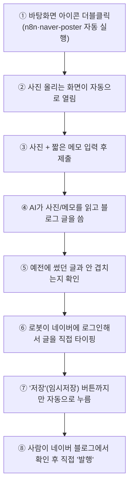

# 원하다 필라테스 블로그 자동화

## 이 프로그램은 무엇을 하나요?

사진 몇 장과 짧은 메모만 입력하면, 나머지는 자동으로 처리됩니다:

1. AI(Claude)가 사진과 메모를 보고 **네이버 블로그에 어울리는 글**을 씁니다 (제목, 도입부, 이모지 소제목이 붙은 본문, 마무리 CTA)
2. 예전에 썼던 글과 소재가 겹치지 않도록 자동으로 확인합니다
3. 그 글을 **실제 네이버 블로그 글쓰기 화면에 사람처럼 직접 타이핑**해서 넣습니다 (제목 → 본문 → 사진을 `[사진 N]` 위치에 삽입 → 고정 문의처/해시태그)
4. **"저장"(임시저장)까지만** 자동으로 누르고 멈춥니다 — 실제 발행은 항상 **사람이 직접** 합니다

> 지금은 **본인의 개인 블로그로 테스트**하도록 만들어져 있습니다. 여러 번 안정적으로 성공하는 걸 확인한 뒤 운영 블로그로 전환하시길 권합니다.

---

## 전체 그림



---

## 폴더 구조

```
wonhada-blog-automation/
├── docker-compose.yml     ← n8n + naver-poster 실행 설정
├── start.bat              ← 바탕화면 아이콘용 실행 파일
├── form/
│   └── index.html         ← 사진+메모 입력 화면 (Vercel 배포용)
├── n8n/
│   └── workflow.json      ← 자동화 설계도
└── naver-poster/
    ├── Dockerfile
    ├── package.json
    ├── server.js           ← 네이버에 실제로 타이핑·저장하는 로봇
    └── login-capture.js    ← 네이버 로그인 세션을 저장하는 스크립트 (Windows에서 직접 실행)
```

---

## 준비물

- [ ] Windows 컴퓨터
- [ ] [Docker Desktop](https://www.docker.com/products/docker-desktop/) — 설치 전 시스템 종류(x64/ARM64) 확인
- [ ] [Node.js LTS](https://nodejs.org)
- [ ] [Anthropic 콘솔](https://console.anthropic.com) API 키 + **지출 한도 설정**
- [ ] 네이버 블로그 계정 (실제 블로그 아이디 확인 필요 — 로그인 아이디와 다를 수 있음)
- [ ] [Vercel](https://vercel.com) 계정 (무료)

> 모든 명령어는 **cmd(명령 프롬프트)** 기준입니다. PowerShell은 보안 정책 오류가 날 수 있습니다.

---

## 설정 순서

### 사전 준비

| # | 할 일 |
|---|---|
| 1 | Docker Desktop 설치 및 실행 확인 |
| 2 | Node.js LTS 설치 → `node -v` 확인 |
| 3 | Anthropic API 키 발급 + 지출 한도 설정 |
| 4 | 이 저장소 clone 또는 zip 압축 해제 |

### A. 네이버 로그인 세션 만들기 (Windows에서 직접)

컨테이너 안에는 화면이 없어서, 이 과정은 Docker 밖 Windows에서 진행합니다.

```cmd
cd wonhada-blog-automation\naver-poster
npm install
npx playwright install chromium
node login-capture.js 본인블로그아이디
```
- 브라우저 창이 뜨면 직접 로그인 (**"로그인 상태 유지" 체크** 권장 — 세션이 오래갑니다)
- 로그인 후 자동으로 글쓰기 화면까지 방문하며, 뜰 수 있는 "도움말" 패널도 미리 닫아둡니다
- cmd로 돌아와 **Enter** → `naver-session.json` 생성 확인

### B. 컨테이너 실행

```cmd
cd wonhada-blog-automation
docker compose up -d --build
docker compose ps
```
`naver-poster`가 `Up` 상태로 유지되는지 확인하세요 (`Restarting`이면 코드에 오타가 있는 것입니다).

### C. 로그인 세션을 컨테이너 안으로 복사

```cmd
docker compose cp naver-poster\naver-session.json naver-poster:/data/naver-session.json
docker compose exec naver-poster ls -la /data
```

### D. `server.js`에 본인 블로그 아이디 반영

메모장으로 `naver-poster/server.js`를 열어 다음 줄을 정확히 수정합니다 (앞뒤 작은따옴표 하나씩만):
```js
const NAVER_BLOG_ID = '본인블로그아이디';
```
수정 후 재빌드:
```cmd
docker compose up -d --build
```
아래로 실제 반영됐는지 재확인:
```cmd
docker compose exec naver-poster grep NAVER_BLOG_ID server.js
```

### E. n8n 초기 설정

1. `http://localhost:5678` 접속 → 관리자 계정 생성
2. `n8n/workflow.json` Import
3. `3. Claude로 초안 생성` 노드 → Anthropic API 키 연결
4. 우측 상단 **Publish** 클릭 → "Production Checklist" 팝업은 "Ignore for all workflows"

### F. Vercel 폼 배포

```cmd
cd form
npm install -g vercel
vercel login
vercel --prod
```
`Name?` 질문엔 **소문자만** 입력. 나온 주소를 복사해둡니다.

### G. `start.bat` 완성

메모장으로 열어 F에서 받은 주소로 교체, 저장. 파일 우클릭 → 복사 → 바탕화면에 붙여넣기 (또는 바로가기 생성).

### H. 테스트

1. 바탕화면 아이콘 더블클릭
2. 폼에서 **실제 필라테스/요가 사진**(스크린샷이 아닌) + 설명 입력 후 제출
3. n8n **Executions** 탭에서 전 노드 성공 확인
4. 네이버 블로그 "임시저장" 목록 확인

---

## 문제가 생기면 — 디버깅 방법

### 화면을 직접 보기 (가장 강력한 방법)
실패하면 자동으로 스크린샷이 저장됩니다:
```cmd
del debug-screenshot.png
docker compose cp naver-poster:/data/debug-screenshot.png .
```
파일을 열어서 실제로 어떤 화면이었는지 확인합니다.

### 로그 확인
```cmd
docker compose logs naver-poster
```

### 코드가 실제로 반영됐는지 확인 (재빌드 누락 의심 시)
```cmd
docker compose exec naver-poster cat server.js
```

---

## 지금까지 겪었던 문제와 원인 (참고용 기록)

| 증상 | 원인 |
|---|---|
| "로그인 세션이 없습니다" | 컨테이너 안에는 화면이 없어 `login-capture.js`가 컨테이너 안에서 실행되면 실패 → Windows에서 직접 실행 후 `docker compose cp`로 복사하는 방식으로 변경 |
| `Cannot read properties of undefined (reading 'match')` | Claude 응답 구조 가정이 틀려서 `content[0].text`가 비어있었음 → 응답에서 text 타입 블록을 명시적으로 찾도록 수정 |
| `locator.click` 타임아웃 (저장 버튼) | "도움말" 안내 패널이 버튼을 가림 → 패널을 닫거나 `force: true`로 강제 클릭 |
| "유효하지 않은 요청입니다" | `NAVER_BLOG_ID`가 예시값(`YOUR_NAVER_ID`)에서 실제 아이디로 반영되지 않은 상태였음 |
| Playwright 버전 불일치 오류 | `package.json`의 Playwright 버전과 Dockerfile 베이스 이미지 버전이 달라서 발생 → 버전을 정확히 고정 |
| 본문에 `\n`이 글자 그대로 찍히고 문장이 중간에 잘림 | Claude 응답이 `max_tokens` 제한(1500)에 걸려 중간에 끊김 → 5000으로 상향, 파싱 실패 시 깨진 내용을 올리지 않고 명확히 에러 처리 |
| `SyntaxError: Unexpected identifier` | `NAVER_BLOG_ID` 값 수정 시 따옴표가 잘못 입력됨 (오타) |
| `start.bat` 실행 시 문자가 깨지며 오류 | 한글 주석이 인코딩 문제를 일으킴 → 한글 주석 없는 최소한의 스크립트로 교체 |

---

## 앞으로는 이렇게만 쓰시면 됩니다

```
바탕화면 아이콘 클릭
   → 사진 + 메모 입력
   → 제출
   → 네이버 블로그 "임시저장함"에서 확인
   → 마음에 들면 직접 "발행" 클릭
```

## 비용

| 항목 | 비용 |
|---|---|
| Docker, n8n, naver-poster | 무료 |
| Vercel | 무료 |
| Claude API (주 2회 기준) | 월 약 500~700원 |

## 앞으로 유지보수 시 참고

- **네이버 화면 개편**: `server.js`의 선택자가 다시 안 맞을 수 있음 → F12로 재확인
- **로그인 세션 만료**(몇 주~몇 달 주기): "세션이 만료되었습니다" 오류가 뜨면 A→C 단계만 재실행
- 컴퓨터를 껐다 켜거나 `docker compose up -d`를 다시 실행해도, 로그인 세션과 n8n 설정은 유지됩니다

## 보안 참고

- 네이버 아이디/비밀번호는 어디에도 저장되지 않고, "이미 로그인된 상태(세션)"만 저장됩니다.
- 세션 파일과 API 키는 `.gitignore`로 GitHub에 올라가지 않도록 막아뒀습니다.
